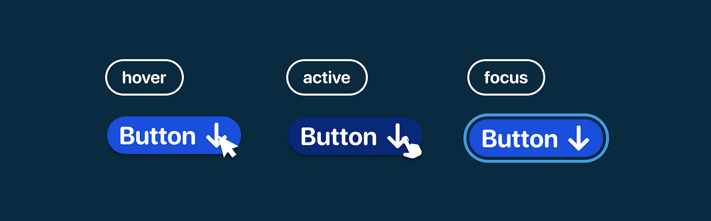

# Теория к пятому занятию

## Формы и UI-элементы

### Архитектура интерактивного взаимодействия: Спецификация веб-форм

**1. Парадигма двустороннего обмена данными и контейнеризация (Тег `<form>`)**

На предыдущих этапах проектирования мы рассматривали интерфейсы исключительно в рамках односторонней парадигмы: как средство представления статической информации (текстовых и графических узлов) пользователю. Спецификация веб-форм фундаментально меняет эту модель, предоставляя стандартизированный инструментарий для сбора пользовательских данных и их последующей защищенной маршрутизации на удаленный сервер.

Базовым структурным элементом данной архитектуры выступает семантический узел `<form>`. В контексте DOM-дерева он функционирует как глобальный контейнер-обертка (wrapper), инкапсулирующий все интерактивные элементы управления (поля ввода, переключатели, кнопки инициации) в единую логическую транзакцию.

**2. Маршрутизация и инкапсуляция: Атрибуты связи с HTTP**

Инженерная механика тега `<form>` неразрывно связана с принципами клиент-серверного взаимодействия и опирается на спецификацию протокола HTTP, которую мы детально изучали ранее. Контейнер управляет жизненным циклом транзакции через два критически важных атрибута:

- **`action="..."` (Определение конечной точки / Endpoint):** Данный атрибут содержит точный URL-адрес сервера или конкретного программного обработчика (скрипта), который должен принять, интерпретировать и обработать полезную нагрузку (payload) собранных данных.

- **`method="..."` (Выбор транспортного механизма):** Декларирует HTTP-метод (глагол), определяющий способ упаковки и передачи данных. В контексте веб-форм применяются два базовых стандарта:


	- `GET`: Данные сериализуются и прикрепляются непосредственно к URL-адресу в виде строки запроса (query string). Этот метод является идемпотентным, передает параметры в открытом виде и применяется исключительно для безопасных операций (например, поисковые запросы или фильтрация каталога).


	- `POST`: Данные инкапсулируются в тело HTTP-запроса (Body), что физически скрывает их из адресной строки браузера. Использование метода POST является строгим архитектурным требованием при передаче конфиденциальной информации (паролей, платежных реквизитов, личных данных).


### Интерактивные элементы управления и семантика ввода данных

Внутри глобального контейнера `<form>` располагаются интерактивные элементы управления (UI-элементы). Их фундаментальная задача заключается в обеспечении интуитивно понятного и алгоритмически безошибочного ввода информации конечным пользователем.

**1. Полиморфизм узла `<input>` и типизация данных**
Универсальный элемент `<input>` представляет собой одиночный (самозакрывающийся) тег, уникальность которого заключается в его способности динамически изменять визуальное представление и функциональное поведение в зависимости от переданного значения атрибута `type`:

- **`type="text"`:** Инициализирует стандартное однострочное текстовое поле, применяемое для захвата неформатированных строковых данных (например, имени пользователя или логина).

- **`type="password"`:** Определяет поле безопасного ввода, в котором вводимые символы маскируются (заменяются типографскими точками или звездочками) в целях предотвращения компрометации конфиденциальных данных на экране пользователя (shoulder surfing).

- **`type="email"`:** Генерирует специализированное поле для ввода адресов электронной почты. Использование данного типа активирует базовую встроенную валидацию со стороны браузера (блокировку отправки при отсутствии паттерна с символом `@`), а на мобильных устройствах — принудительный вызов специализированной раскладки клавиатуры.

- **`type="checkbox"`:** Рендерит элемент управления в виде флажка (квадратного чекбокса), предназначенного для реализации неисключающего (множественного) выбора из предложенного массива опций.

- **`type="radio"`:** Формирует переключатель (круглую радиокнопку), логика которого ограничивает пользователя строгим одиночным выбором из группы взаимоисключающих альтернатив (например, спецификация пола или метода оплаты).

**2. Идентификация полей и стандарты доступности (Тег `<label>`)**
Семантический узел `<label>` выполняет функцию текстового идентификатора (подписи) для конкретного поля ввода. Это критически важный структурный элемент для обеспечения веб-доступности (a11y) и оптимизации пользовательского опыта (UX).

- Инженерный стандарт требует программного связывания тега `<label>` с целевым узлом `<input>` посредством точного сопоставления значений атрибутов `for` (у подписи) и `id` (у поля ввода).

- При успешном связывании возникает эффект делегирования фокуса: клик по текстовому узлу автоматически переводит фокус ввода в ассоциированное текстовое поле или инвертирует состояние переключателя (чекбокса).

- Данный паттерн особенно критичен для мобильных интерфейсов, поскольку он физически увеличивает активную область нажатия (hitbox), компенсируя сложность точного взаимодействия (touch) пальцем с малогабаритными элементами интерфейса.

**3. Инициация транзакции (Тег `<button>`)**
Любая функциональная форма обязана содержать триггер инициации отправки данных.

- Использование элемента `<button type="submit">` декларирует этот узел как главный исполнительный механизм формы.

- При регистрации события нажатия (click event) на данной кнопке, браузерный движок автоматически обходит DOM-дерево, собирает значения из всех элементов `<input>`, упаковывает их в полезную нагрузку и осуществляет отправку HTTP-запроса по URL-адресу, определенному в атрибуте `action` родительского тега `<form>`.

```html
<form action="/api/register" method="POST">

    <div class="form-group">
        <label for="user_name">Имя пользователя:</label>
        <input type="text" id="user_name" name="username" placeholder="Иван Иванов" required>
    </div>

    <div class="form-group">
        <label for="user_email">Электронная почта:</label>
        <input type="email" id="user_email" name="email" placeholder="example@mail.com" required>
    </div>

    <div class="form-group">
        <label for="user_password">Пароль:</label>
        <input type="password" id="user_password" name="password" required>
    </div>

    <fieldset class="form-group">
        <legend>Ваш уровень подготовки:</legend>
        
        <div>
            <input type="radio" id="level_beginner" name="skill_level" value="beginner" checked>
            <label for="level_beginner">Новичок</label>
        </div>
        <div>
            <input type="radio" id="level_pro" name="skill_level" value="pro">
            <label for="level_pro">Продвинутый</label>
        </div>
    </fieldset>

    <div class="form-group checkbox-group">
        <input type="checkbox" id="user_agreement" name="agreement" required>
        <label for="user_agreement">Я согласен на обработку персональных данных</label>
    </div>

    <button type="submit">Зарегистрироваться</button>

</form>
```

### Проектирование визуального отклика: CSS-псевдоклассы

Статичный интерфейс воспринимается конечным пользователем как нереспонсивный или зависший. Проектирование качественного пользовательского опыта (UX) требует, чтобы интерактивные узлы реагировали на действия пользователя еще до момента фактического подтверждения действия (нажатия). Для реализации этой механики в спецификации CSS применяются псевдоклассы — специализированные ключевые слова, добавляемые к селекторам для описания особого динамического состояния элемента.  Синтаксис любого псевдокласса строго начинается с символа двоеточия (`:`).

**1. Регистрация наведения указателя: псевдокласс `:hover`**

- Данное состояние активируется в момент, когда пользователь наводит курсор координатного устройства (мыши) на геометрическую область элемента.

- Обработка этого состояния является критически важным архитектурным требованием для ссылок и кнопок: интерфейс обязан формировать аффорданс — визуально подсказывать пользователю, что данный элемент является кликабельным и готов к взаимодействию.

```css
.submit-btn {
    background-color: blue;
    cursor: pointer; 
}

.submit-btn:hover {
    background-color: darkblue; 
}
```

**2. Управление фокусом ввода: псевдокласс `:focus`**

Это состояние инициируется, когда HTML-узел становится активным приемником событий ввода (например, когда пользователь устанавливает курсор в текстовое поле с помощью клика мыши или осуществляет последовательную навигацию по DOM-дереву с использованием клавиши `Tab`).

**Строгий стандарт веб-доступности (Accessibility / a11y):** Категорически запрещается удалять стандартное визуальное выделение фокуса браузера (как правило, реализуемое через свойство `outline`), не предоставив взамен равноценную, хорошо различимую графическую альтернативу.

- Если полностью скрыть состояние фокуса, пользователи, взаимодействующие с интерфейсом исключительно посредством клавиатуры (или специализированных устройств), физически утратят возможность навигации по документу.

```css
.text-input:focus {
    border: 2px solid green; 
    outline: none; 
}
```



Подробнее про псевдоклассы можно узнать [тут](https://developer.mozilla.org/ru/docs/Web/CSS/Reference/Selectors/Pseudo-classes)


### Плавная деградация состояний и временная интерполяция (Свойство `transition`)

Дискретное (мгновенное) изменение визуальных характеристик элемента при активации псевдоклассов (например, `:hover`) воспринимается человеческим глазом неестественно и снижает общее качество пользовательского опыта. Для проектирования премиального и эргономичного интерфейса применяется механизм CSS-транзиций (переходов). Этот инструментарий обеспечивает алгоритмически плавную интерполяцию значений свойств от исходного состояния к конечному с течением времени.

**Архитектурное правило декларации:**
Свойство `transition` выступает в роли сокращенной записи (shorthand) для целой группы параметров анимации. **Критически важно:** данное свойство всегда должно декларироваться в базовом (исходном) классе элемента, а не внутри селектора его псевдокласса. Это гарантирует, что движок браузера корректно рассчитает плавность анимации в обоих направлениях: как при наведении курсора, так и при его отведении.

```css
.card {
    background-color: white;
    transition: background-color 0.3s ease; 
}

.card:hover {
    background-color: lightgray;
}
```

**Декомпозиция параметров свойства `transition`:**

- **`transition-property` (Целевое свойство):** Определяет, какое конкретно CSS-свойство должно быть подвергнуто анимации (например, `background-color`, `transform`, или служебное ключевое слово `all` для инициации параллельного вычисления всех доступных свойств).


- **`transition-duration` (Продолжительность цикла):** Устанавливает временной интервал выполнения анимации, выраженный в секундах (например, `0.3s`) или миллисекундах (`300ms`).


*Инженерный UX-стандарт:* В современных веб-интерфейсах продолжительность микроанимаций строго регламентируется диапазоном от 0.2s до 0.4s. Превышение этого порога формирует у пользователя ложное ощущение низкой производительности («вязкости» и заторможенности) системы.


**`transition-timing-function` (Математическая функция времени):** Описывает кривую ускорения (обычно кривую Безье), которая определяет характер изменения скорости на протяжении заданного временного отрезка.


- `ease` (Значение по умолчанию): Обеспечивает асимметричную кривую — плавный старт, экспоненциальное ускорение в середине цикла и очень плавное замедление к финишу (максимально имитирует физику объектов в реальном мире).


- `linear`: Осуществляет строго линейную интерполяцию с константной (неизменной) скоростью на всем отрезке времени.


- `ease-in-out`: Симметричная кривая, обеспечивающая одинаково плавные фазы разгона (в начале) и торможения (в конце).

Подробнее прочитать про transition можно [тут](https://developer.mozilla.org/ru/docs/Web/CSS/Reference/Properties/transition)