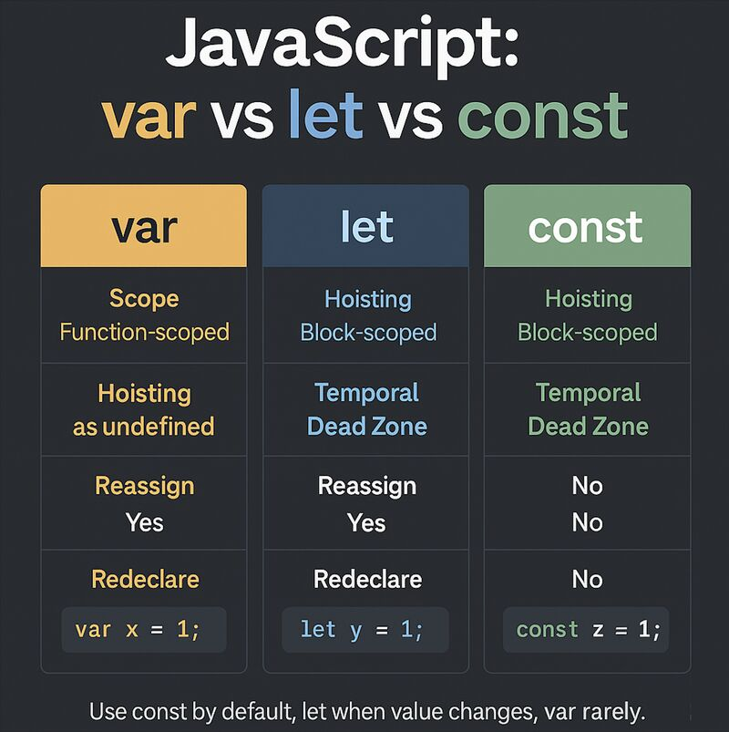

# Теория к шестому занятию

## Основы логики JavaScript

### Парадигма JavaScript и его архитектурная роль в браузере

**1. Эволюция от статики к динамике: Роль JavaScript**

На предыдущих этапах проектирования веб-интерфейсов мы оперировали исключительно декларативными языками. HTML применялся для семантической структуризации контента, а CSS — для его визуального форматирования, что в совокупности формировало абсолютно статичный документ.

JavaScript (JS) в корне меняет эту парадигму, представляя собой полноценный, мультипарадигменный язык программирования. В трехуровневой архитектуре веб-интерфейса он выполняет функцию поведенческого (интерактивного) слоя, выступая в роли «мышечной и нервной системы» страницы.

С технической точки зрения, интеграция JS позволяет клиентской части приложения:

- Алгоритмически реагировать на различные действия пользователя (события мыши, сенсорного экрана, клавиатуры).

- Осуществлять сложные локальные математические и логические вычисления.

- Инициировать асинхронные сетевые запросы к серверу для обмена данными в фоновом режиме.

- Осуществлять манипуляции с объектной моделью документа (DOM) — динамически перестраивать, добавлять или удалять узлы HTML-дерева без необходимости полной перезагрузки страницы.

**2. Интеграция скриптов и управление парсингом (Тег `<script>`)**

В соответствии с фундаментальным инженерным принципом разделения ответственности (Separation of Concerns), программную логику на JavaScript строго рекомендуется изолировать от HTML-разметки, вынося ее во внешние файлы.

Физическая интеграция внешнего скрипта в документ осуществляется посредством парного тега `<script>`:

```html
<script src="main.js" defer></script>
```

**Механика загрузки и проблема блокировки рендеринга:**
По умолчанию алгоритм браузера является синхронным. Когда парсер HTML встречает тег `<script>`, он обязан приостановить построение DOM-дерева, загрузить скрипт по сети и полностью его выполнить. Лишь после этого разбор HTML продолжается.

- **Исторический паттерн:** В связи с этим блокирующим поведением (render-blocking), традиционное инженерное правило предписывало помещать теги `<script>` в самый низ HTML-документа, непосредственно перед закрывающим тегом `</body>`. Это гарантировало, что тяжелый скрипт не заблокирует первичную отрисовку графического интерфейса.


- **Современный стандарт (`defer`):** Сегодня скрипты предпочтительно подключать в служебной секции `<head>`, но с обязательным добавлением булевого атрибута `defer` (отложенное выполнение). Данный атрибут модифицирует алгоритм браузера: он приказывает загружать файл скрипта асинхронно (в фоновом режиме, не прерывая парсинг HTML), однако фактическое выполнение кода строго откладывается до того момента, пока весь HTML-документ не будет полностью прочитан и визуализирован. Это решает проблему производительности и гарантирует доступность всех элементов DOM к моменту запуска логики.

### Интерфейс отладки: Знакомство с Консолью

JavaScript не имеет собственного графического интерфейса — он работает «под капотом» браузера. Чтобы разработчик мог общаться с языком, видеть результаты вычислений или искать ошибки, используется встроенная консоль браузера (вкладка Console в DevTools).

Главный инструмент вывода данных — метод `console.log()`:

```JavaScript
console.log("Привет, мир!");
console.log(10 + 15);
```

При выполнении этого кода пользователь на сайте ничего не увидит, но разработчик в консоли получит строку "Привет, мир!" и число 25. Это фундаментальный инструмент для тестирования логики.


### Аллокация памяти и управление состоянием: Идентификаторы (`let` и `const`)

**1. Концепция хранения состояний в памяти**
Любое программное обеспечение нуждается в механизмах сохранения промежуточных состояний (например, имен пользователей, счетчиков итераций или результатов математических вычислений). Для выполнения этой задачи интерпретатор задействует оперативную память вычислительной машины.

В контексте программирования переменная представляет собой именованный идентификатор (абстрактную ячейку памяти или «коробку»), который связывается с определенным значением, позволяя разработчику сохранять данные и впоследствии обращаться к ним по заданному имени.

**2. Лексические декларации в современном стандарте (ES6+)**
Согласно современной спецификации ECMAScript (начиная со стандарта ES6), выделение памяти и инициализация переменных осуществляются двумя основными лексическими конструкциями, обладающими строгой блочной областью видимости:

* **`let` (Изменяемый идентификатор / Mutable state):**
Данный оператор применяется для объявления переменных в тех случаях, когда архитектура алгоритма заранее предполагает последующее изменение (перезапись) хранимого значения в процессе выполнения программы.

```javascript
let userAge = 20; // Инициализация ячейки памяти значением 20
userAge = 21;     // Успешная перезапись (мутация) значения

```

* **`const` (Иммутабельная ссылка / Константа):**
Применяется для объявления структур данных, значения которых должны строго оставаться неизменными после этапа их первичной инициализации. Любая попытка переназначить такую переменную вызовет фатальную ошибку исполнения.


```javascript
const birthYear = 2004;
// birthYear = 2005; -> Ошибка: TypeError (Попытка присвоения значения константе)

```

**3. Архитектурные стандарты и безопасность кода**

* **Принцип неизменяемости по умолчанию:** В современной программной инженерии действует строгий паттерн — по умолчанию всегда следует использовать декларацию `const`.

* **Обоснованные мутации:** Переход к использованию оператора `let` допускается исключительно в ситуациях, когда алгоритм математически диктует необходимость перезаписи значения (например, при реализации счетчиков или шагов в циклах).


* **Защита от побочных эффектов:** Следование этому правилу минимизирует вероятность возникновения логических ошибок и надежно защищает кодовую базу от непреднамеренных случайных мутаций данных.


* **Отказ от устаревших практик:** Использование устаревшего ключевого слова `var` в современной разработке категорически не рекомендуется ввиду архитектурных недостатков, связанных с непредсказуемым поведением области видимости (отсутствие строгой блочной изоляции и эффект "всплытия" переменных).



### Алгоритмическое ветвление и управляющие конструкции (`if / else`)

**1. Парадигма нелинейного выполнения потока**
Базовая модель императивного программирования подразумевает строгое линейное (последовательное) выполнение инструкций интерпретатором сверху вниз. Однако для реализации сложной логики программе необходим механизм динамического принятия решений на основе текущего состояния данных. Для управления потоком выполнения (Control Flow) применяются конструкции условного ветвления, где фундаментальным инструментом выступает оператор `if`.

**2. Механика работы условного оператора**
Алгоритм ветвления базируется на строгой оценке логического выражения (булевой алгебре):

* Интерпретатор вычисляет выражение, инкапсулированное в круглые скобки.


* Если результатом вычисления является значение `true` (истина), движок инициирует выполнение локального блока инструкций, заключенного в первые фигурные скобки.


* Если выражение возвращает `false` (ложь), интерпретатор алгоритмически игнорирует первый блок и делегирует управление резервному блоку `else` (если он предусмотрен архитектурой), либо продолжает линейное чтение последующего кода.

```javascript
const userAge = 16;

if (userAge >= 18) {
    console.log("Доступ разрешен. Добро пожаловать!");
} else {
    console.log("Доступ запрещен. Вы слишком молоды.");
}

```

**3. Операторы сравнения (Relational Operators) и строгое тождество**
Для конструирования логических условий применяются специализированные операторы, которые производят сопоставление операндов и всегда возвращают булево значение (`true` или `false`):

* `>` (Строго больше) и `<` (Строго меньше).


* `>=` (Больше или равно) и `<=` (Меньше или равно).


* `===` (Оператор строгого тождества): 

**Фундаментальный инженерный стандарт JavaScript**. В отличие от классического нестрогого равенства (`==`), данный оператор проверяет не только эквивалентность значений, но и полное совпадение типов данных. Его использование обязательно, так как оно исключает непредсказуемое поведение алгоритма, связанное с неявным приведением типов (Type Coercion).


### Алгоритмические итерации и автоматизация выполнения: Циклы (`for`)

**1. Парадигма циклических вычислений**

В инженерной практике регулярно возникают задачи, требующие многократного (сотни или тысячи раз) выполнения идентичных или однотипных инструкций, например, рендеринг массива карточек товаров на экране. Ручное дублирование кода (например, многократный вызов функции `console.log()`) является грубым нарушением инженерных принципов и считается алгоритмической ошибкой. Для решения этой проблемы и автоматизации процессов в языках программирования применяются специализированные конструкции — циклы.

**2. Архитектура и синтаксис цикла `for`**

Наиболее распространенным и детерминированным инструментом для создания итераций является цикл `for`. Его лексическая структура базируется на трех управляющих выражениях (настройках), которые строго разделяются точкой с запятой внутри круглых скобок:

* **Инициализация (Initialization):** Объявление и первичное присвоение значения локальной переменной-счетчику (традиционно используется `let i = 0`). Данный шаг выполняется интерпретатором строго один раз перед началом всего цикла.


* **Условие выполнения (Condition):** Логическое (булево) выражение, которое вычисляется перед каждой новой итерацией (например, `i < 5`). Цикл продолжает свою работу исключительно до тех пор, пока данное условие возвращает значение `true` (истина).


* **Инкремент/Декремент (Step / Final Expression):** Математическая операция, выполняемая в самом конце каждой итерации, предназначенная для изменения состояния счетчика. Запись `i++` является синтаксическим сахаром (сокращением) для операции `i = i + 1`.

```javascript
for (let i = 0; i < 5; i++) {
    console.log("Текущий круг цикла номер: " + i);
}
```

**3. Механика исполнения (Control Flow)**
Жизненный цикл данной конструкции подчиняется строгой последовательности вычислений. Сначала интерпретатор создает переменную `i` (равную 0) и проверяет базовое условие (`0 < 5`). Поскольку условие истинно, выполняется код внутри фигурных скобок, а затем срабатывает математический шаг (счетчик увеличивается на 1).

Этот процесс повторяется циклично до того момента, пока переменная `i` не достигнет значения 5. Как только проверка `5 < 5` возвращает логическое значение `false` (ложь), механизм цикла немедленно прерывается, и интерпретатор делегирует управление потоком следующим за циклом строкам кода.

Подробнее узнать - [тут](https://learn.javascript.ru/while-for)