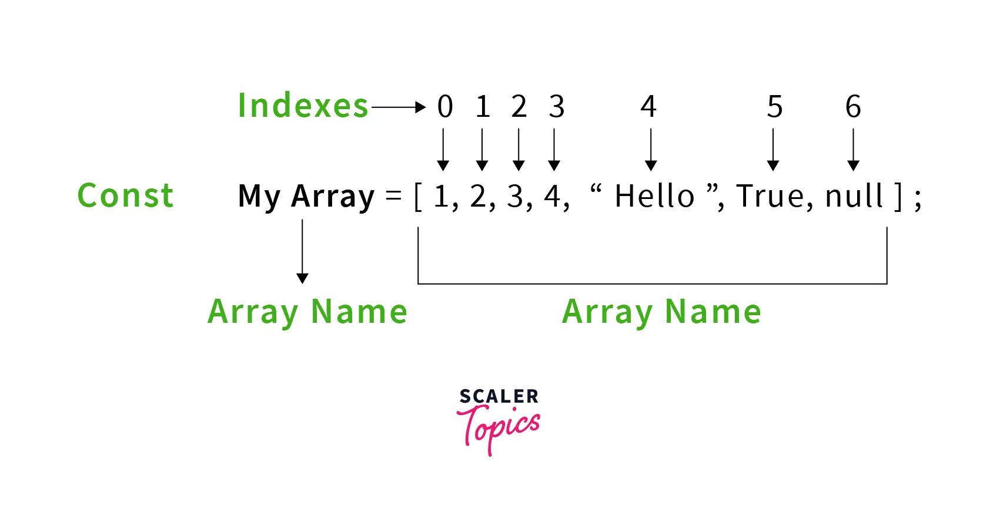
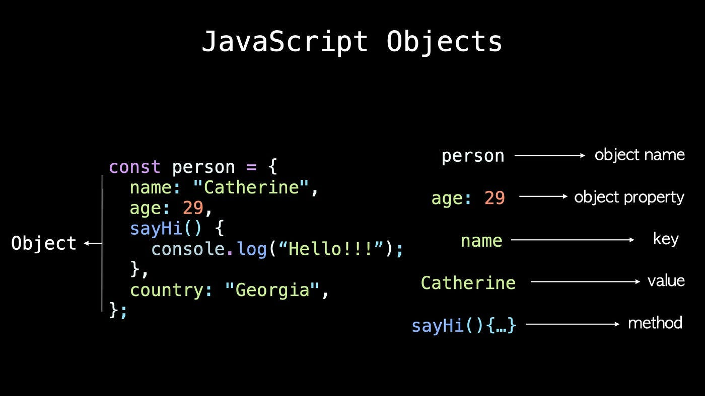
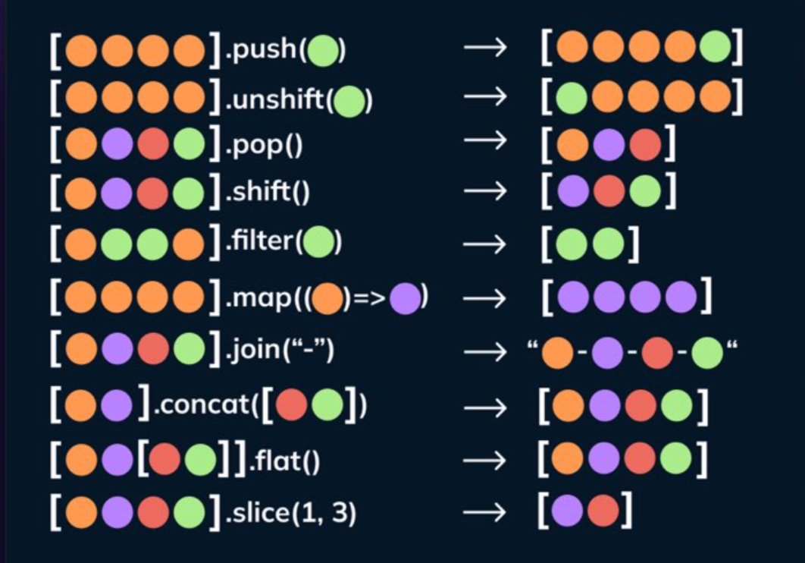

# Теория к седьмому занятию

### Эволюция от скалярных типов к структурам данных: Массивы (Arrays)

**1. Ограничения скалярных величин и потребность в коллекциях**
До этого момента мы оперировали исключительно примитивными типами данных, где одна переменная хранила ровно одно неделимое значение (например, `const age = 20;`). В информатике такие величины классифицируются как скалярные.

Однако при проектировании реальных интерфейсов неизбежно возникает задача хранения множества однотипных сущностей, например, списка из 100 товаров или имен всех зарегистрированных пользователей сайта. Создание 100 изолированных переменных (`const user1`, `const user2` и т.д.) является архитектурным тупиком, который делает невозможной автоматическую обработку данных. Для решения этой проблемы и эффективного управления коллекциями информации применяются специализированные структуры данных.

**2. Массивы как упорядоченные списки (Linear Data Structures)**
Массив (Array) представляет собой базовую структуру данных, реализующую концепцию строго упорядоченного списка элементов.

* Для упрощения понимания можно использовать метафору поезда: весь состав целиком представляет собой единый массив, а каждый отдельный вагон — это ячейка памяти, в которую можно поместить любые данные (числовые значения, строки или даже другие вложенные массивы).

* Каждый такой «вагон» обладает своим строгим порядковым номером в цепочке.

Синтаксически инициализация (создание) массива в коде требует использования оператора литерала массива, который обозначается квадратными скобками `[ ]`:

```javascript
const fruits = ["Яблоко", "Банан", "Апельсин"];
```

**3. Механизм индексации и доступ к элементам памяти (Zero-based Indexing)**
Фундаментальное инженерное правило, принятое в большинстве современных языков программирования: отсчет элементов всегда начинается с нуля (0), а не с единицы (1). Это обусловлено тем, что в низкоуровневой архитектуре номер элемента отражает его математическое смещение (offset) от начала блока памяти.

* Этот порядковый номер элемента в структуре массива терминологически называется индексом.

* Чтобы извлечь информацию из массива, необходимо обратиться к переменной, хранящей этот массив, и в квадратных скобках передать точный индекс (смещение) нужного «вагона».


```javascript
console.log(fruits[0]); // Возвращает: "Яблоко" (Первый элемент, смещение 0)
console.log(fruits[2]); // Возвращает: "Апельсин" (Третий элемент, смещение 2)
```



### Объектно-ориентированное моделирование данных: Объекты (Objects)

**1. Архитектурные ограничения массивов и потребность в ассоциативных структурах**
Массивы (линейные списки) оптимальны для хранения простых, однотипных коллекций данных. Однако при необходимости смоделировать многосоставную сущность реального мира (например, сложный профиль пользователя или детальную спецификацию товара), использование индексированного массива приводит к архитектурным сложностям.

Например, при декларации `const user = ["Иван", 25, "ivan@mail.com"];` разработчик вынужден полагаться на так называемые «магические числа» — держать в уме, что индекс `1` жестко и неявно привязан к возрасту. Это делает программный код хрупким и трудноподдерживаемым.

Для структурированного и семантически понятного описания подобных сущностей применяется ссылочный тип данных — Объект (Object). В терминах информатики это ассоциативный массив (или словарь). В отличие от классических массивов, данная структура хранит информацию не по математическому порядковому номеру, а в формате строго связанных пар «Ключ: Значение» (Key-Value pairs).

**2. Синтаксис литерала объекта и инициализация**
В JavaScript процесс инициализации объекта чаще всего осуществляется через синтаксис объектного литерала, который обозначается фигурными скобками `{ }`:

```javascript
const product = {
    title: "iPhone 15",
    price: 99000,
    isAvailable: true
};
```

Декомпозиция синтаксиса:

* **Ключи (Свойства / Properties):** В нашем примере `title`, `price`, `isAvailable` выступают в роли уникальных строковых идентификаторов для доступа к данным. Согласно спецификации, они записываются без кавычек, если состоят из одного слова и соответствуют правилам именования переменных.

* **Значения (Values):** Данные, привязанные к ключам (например, `"iPhone 15"`, `99000`, `true`), могут принадлежать к абсолютно любому допустимому типу данных JavaScript (быть строкой, числом, логическим значением, или даже другим вложенным объектом).

* **Структурное правило:** Каждая пара «Ключ: Значение» внутри тела объекта должна строго отделяться от последующей с помощью запятой.



**3. Механизмы доступа к свойствам и мутация состояния (Dot Notation)**
Для извлечения (чтения) или изменения (мутации) значений, инкапсулированных внутри объекта, наиболее распространенным и удобным инженерным подходом является использование точечной нотации (Dot Notation):

```javascript
console.log(product.title); // Выведет строковое значение: "iPhone 15"
console.log(product.price); // Выведет числовое значение: 99000

// Мутация состояния объекта:
product.price = 85000;

```

Синтаксис `имя_объекта.имя_ключа` позволяет интерпретатору напрямую обратиться к выделенному участку памяти, ассоциированному с этим ключом, минуя необходимость перебора всей структуры данных.


### Архитектурные паттерны: Массивы объектов как модели баз данных

**1. Парадигма комбинирования структур данных**
В промышленной разработке программного обеспечения — при проектировании серверных архитектур, разработке REST API или клиентских интерфейсов электронной коммерции — данные крайне редко оперируются в формате изолированных примитивных массивов или единичных объектов. Для построения масштабируемых информационных архитектур применяется фундаментальный паттерн **«Массив объектов» (Array of Objects)**.

С точки зрения структур данных, этот паттерн представляет собой строго упорядоченный список (индексированный массив), в котором каждый атомарный элемент (узел) инкапсулирует полноценный, независимый ассоциативный массив (объект). Данная многомерная топология является де-факто стандартом для моделирования реляционных баз данных на стороне клиента: сам массив выступает аналогом базы данных или таблицы, а вложенные объекты — аналогами строк с конкретными записями.

**2. Декларативный синтаксис локальной БД**

```javascript
const catalog = [
    {
        id: 1,
        title: "Ноутбук Apple MacBook Air",
        price: 120000,
        category: "laptops"
    },
    {
        id: 2,
        title: "Смартфон Samsung Galaxy",
        price: 85000,
        category: "phones"
    },
    {
        id: 3,
        title: "Наушники Sony",
        price: 25000,
        category: "audio"
    }
];

```

**3. Алгоритмическая навигация по многомерным структурам (Data Traversal)**
Для извлечения специфических значений из подобной комбинированной структуры, интерпретатор JavaScript осуществляет последовательный (строго слева направо) обход памяти по цепочке ссылок: первоначально происходит обращение к элементу массива по его математическому индексу, после чего выполняется доступ к конкретному свойству извлеченного объекта посредством точечной нотации (Dot notation).

```javascript
// Задача: динамически извлечь цену смартфона Samsung
console.log(catalog[1].price); // Возвращает числовое значение: 85000
```

### Алгоритмическая обработка коллекций: Встроенные методы массивов

В языке JavaScript массив (Array) представляет собой не просто статичный участок выделенной памяти, а сложный глобальный объект, инкапсулирующий мощный инструментарий для манипуляции собственным содержимым. Эти встроенные функции-обработчики терминологически называются **методами**. С архитектурной точки зрения они разделяются на две фундаментальные категории: мутирующие (изменяющие исходное состояние) и итерационные (основанные на принципах функционального программирования).

**1. Деструктивные (Мутирующие) методы изменения длины**

Данная группа методов непосредственно модифицирует (мутирует) исходную структуру данных в оперативной памяти.

**Операции со стеком (LIFO — Last In, First Out):**
* **`push()`:** Алгоритмически добавляет один или несколько переданных элементов строго в конец массива. С точки зрения производительности, это быстрая операция (сложность O(1)), так как она не требует изменения индексов уже существующих элементов.
* **`pop()`:** Извлекает (удаляет) строго последний элемент из массива, уменьшая его длину на единицу, и возвращает извлеченное значение.

**Операции с очередью (FIFO — First In, First Out):**
* **`unshift()` и `shift()`:** Выполняют аналогичные операции добавления и удаления, но применяются **исключительно к началу массива** (к индексу 0).
* *Инженерный нюанс (Алгоритмическая сложность):* Преподавателю крайне важно подчеркнуть, что эти методы работают значительно медленнее (сложность O(n)). При удалении или добавлении нулевого элемента интерпретатор вынужден заново пересчитать и сдвинуть на одну позицию индексы абсолютно всех последующих элементов в массиве. В коллекциях из тысяч записей это может вызвать просадку производительности (bottleneck).

**2. Итерационные методы высшего порядка (Спецификация ES6+)**

С внедрением стандарта ECMAScript 6 в JavaScript была интегрирована парадигма функционального программирования. Вместо использования классических императивных циклов (`for` или `while`), современный стандарт предписывает использование методов высшего порядка. Они автоматически итерируются (проходят) по массиву и принимают в качестве аргумента функцию обратного вызова (callback-функцию), которая применяется к каждому узлу коллекции.

* **`forEach()` (Императивная итерация с побочными эффектами):**
Осуществляет последовательный перебор массива, выполняя переданную callback-функцию для каждого элемента. Данный метод является прямой декларативной альтернативой циклу `for`. Он всегда возвращает `undefined` и используется исключительно для создания побочных эффектов (side effects), например, для вывода данных в консоль.

```javascript
const users = ["Анна", "Иван", "Олег"];
// Лексически лаконичная запись с использованием стрелочной функции
users.forEach(user => console.log("Привет, " + user));

```

* **`map()` (Математическая проекция / Трансформация):**
Фундаментальный метод функционального программирования. Он итерируется по массиву, применяет callback-функцию к каждому элементу и **генерирует абсолютно новый массив** из полученных результатов, гарантируя иммутабельность (неизменность) исходных данных. В современной фронтенд-разработке это основной инструмент для трансформации массива «сырых» данных (JSON) в массив готовых HTML-узлов или UI-карточек.


```javascript
const prices = [100, 200, 300];
// Проекция: каждый элемент умножается на коэффициент 1.2
const withTax = prices.map(price => price * 1.2); 
// Результат (Новый участок памяти): [120, 240, 360]

```


* **`filter()` (Алгоритмическая выборка):**
Метод предназначен для фильтрации коллекции на основе заданного предиката (логического условия). Callback-функция обязана возвращать булево значение. Метод создает новый массив, в который копируются строго те элементы исходного массива, для которых выполнение функции вернуло `true` (истина).


```javascript
const ages = [12, 18, 25, 8];
// Предикат: оставить только значения больше или равные 18
const adults = ages.filter(age => age >= 18);
// Результат (Отфильтрованная копия): [18, 25]

```



### Декомпозиция ассоциативных структур: Статические методы `Object`

В связи с тем, что классические объекты в JavaScript являются ассоциативными (неитерируемыми) структурами данных — они не имеют математических индексов и не гарантируют строгий порядок элементов, — к ним невозможно напрямую применить стандартные алгоритмы последовательного перебора, такие как цикл `for` или функциональные методы вроде `map()`.

Для преодоления этого архитектурного ограничения в ядро языка встроен глобальный статический класс `Object`. Он предоставляет специализированный инструментарий, позволяющий алгоритмически сериализовать (разобрать) любую ассоциативную структуру в классические итерируемые массивы.

* **`Object.keys(obj)` (Экстракция ключей):** Изолированно извлекает из объекта все его строковые идентификаторы (названия свойств) и возвращает их в виде одномерного массива.
* **`Object.values(obj)` (Экстракция полезной нагрузки):** Игнорирует ключи и собирает исключительно сами данные (содержимое), упаковывая их в новый массив.
* **`Object.entries(obj)` (Генерация матрицы):** Трансформирует объект в двумерный массив (массив массивов), где каждый вложенный элемент представляет собой кортеж (tuple) из двух значений: `[ключ, значение]`.

```javascript
const user = { name: "Иван", role: "admin", age: 30 };

// Трансформация ассоциативной структуры в итерируемые списки
console.log(Object.keys(user));   // Возвращает: ["name", "role", "age"]
console.log(Object.values(user)); // Возвращает: ["Иван", "admin", 30]

```

**Практическая (Инженерная) значимость:** Понимание этих методов критически важно при интеграции с серверными API. Когда фронтенд-приложение получает от сервера сложный JSON-объект (например, глобальные настройки профиля), разработчик не может сразу отрисовать его в интерфейсе. Использование `Object.values()` или `Object.entries()` позволяет мгновенно конвертировать этот объект в линейный массив и пропустить его через метод `map()` для динамической генерации HTML-узлов на экране.

### Расширенные структуры данных спецификации ES6 (`Map` и `Set`)

Несмотря на то что паттерн «Массив объектов» покрывает подавляющее большинство типовых задач по управлению состоянием, спецификация ECMAScript 2015 (ES6) внедрила новые, высокопроизводительные структуры данных для решения специфических алгоритмических и архитектурных проблем.

**1. Коллекции уникальных значений: Структура `Set` (Множество)**
Структура `Set` реализует строгую математическую концепцию множества. Визуально и синтаксически она напоминает обычный массив, однако подчиняется одному фундаментальному правилу: **абсолютная уникальность элементов**. Механизм `Set` на уровне процессинга памяти блокирует добавление дубликатов, гарантируя, что каждое значение встречается в коллекции ровно один раз.

*Инженерная задача (Дедупликация данных):* Если необходимо извлечь список уникальных категорий из огромного массива товаров (где категории многократно повторяются), пропуск этого «грязного» массива через конструктор `Set` является самым производительным и элегантным решением (по сравнению с написанием сложных вложенных циклов с проверками).

```javascript
const categories = ["Обувь", "Одежда", "Обувь", "Аксессуары", "Одежда"];
// Алгоритмическая очистка дубликатов через инициализацию множества
const uniqueCategories = new Set(categories);

console.log(uniqueCategories); // Возвращает: Set(3) {"Обувь", "Одежда", "Аксессуары"}

```

*Ключевые методы для манипуляций:* `.add(value)` (добавление), `.delete(value)` (удаление), `.has(value)` (сверхбыстрая проверка наличия элемента, алгоритмическая сложность O(1)).

**2. Расширенные ассоциативные коллекции: Структура `Map` (Словарь)**
Коллекция `Map` — это усовершенствованная реализация концепции «Ключ: Значение». Стандартные объекты имеют жесткое архитектурное ограничение: движок языка неявно (через type coercion) преобразует любые их ключи строго в строки.

Структура `Map` полностью снимает этот лимит. В `Map` **ключом может выступать абсолютно любой тип данных**: примитивные числа, логические значения, другие массивы, функции и даже физические DOM-узлы HTML-страницы. Кроме того, в отличие от классических объектов, `Map` строго детерминирует и сохраняет хронологический порядок добавления пар в коллекцию.

```javascript
const myMap = new Map();

// Метод set(key, value) инициирует запись в словарь
myMap.set("name", "Иван"); // Классический строковый ключ
myMap.set(100, "Числовой ключ"); // Ключом выступает тип Number! 
myMap.set(document.body, "Тег body как ключ"); // В качестве ключа передана ссылка на DOM-узел!

// Метод get(key) осуществляет поиск и извлечение данных
console.log(myMap.get(100)); // Возвращает: "Числовой ключ"

```