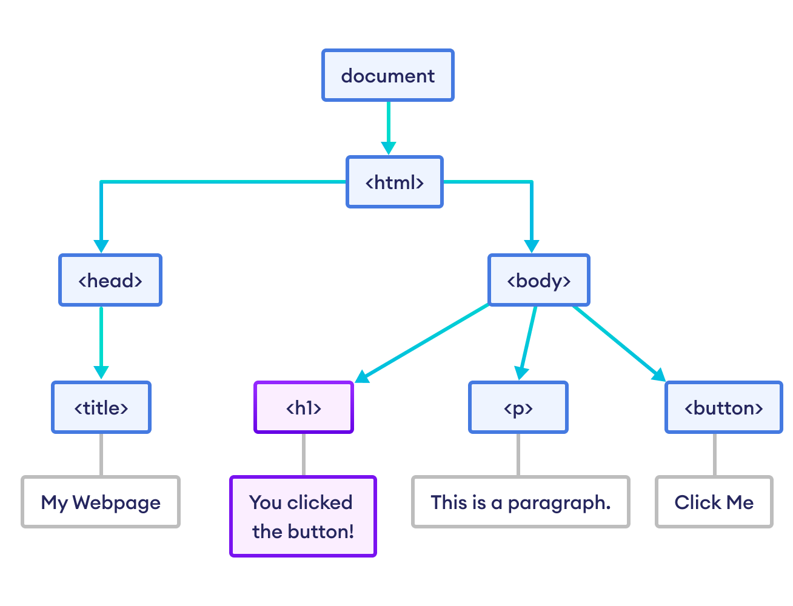

# Теория к восьмому занятию

## Взаимодействие с DOM

### Объектная модель документа (DOM): Архитектурная абстракция интерфейса

**1. Фундаментальная проблема статической разметки**
Как обсуждалось на вводных лекциях, HTML представляет собой исключительно декларативный текстовый формат. В процессе загрузки страницы парсер браузера читает эту строку текста и выстраивает из нее визуальный интерфейс. Однако сам по себе HTML абсолютно статичен — после завершения парсинга он не способен реагировать на события или изменять свои данные.

Поскольку среда выполнения JavaScript не может напрямую и эффективно манипулировать «сырым» текстом HTML-файла для обновления интерфейса, браузер конструирует специализированный программный мост (API) — **DOM (Document Object Model, Объектную модель документа)**.

**2. Топология данных: Древовидная структура и Узлы (Nodes)**
С точки зрения теории структур данных, DOM представляет собой направленное иерархическое дерево (n-арное дерево), развернутое в оперативной памяти компьютера.

* В процессе компиляции интерпретатор берет абсолютно каждый элемент разметки (каждый тег, текстовый блок внутри тега и даже HTML-комментарии) и конвертирует его в независимую единицу памяти — **Узел (Node)**.
* Эти узлы выстраиваются в строгую иерархию (родитель -> потомок), точно повторяя вложенность ваших HTML-тегов, где на самой вершине графа находится корневой элемент — тег `<html>`.

**3. Объектно-ориентированная природа интерфейса**
Критически важное архитектурное следствие: в процессе конвертации в DOM-дерево, каждый HTML-тег физически превращается в **полноценный JavaScript-объект**.

Опираясь на знания из седьмого дня (Объекты), мы понимаем, что это означает на практике: как и любой JS-объект, HTML-тег приобретает собственный набор ключей и значений.

* **Свойства (Properties):** Характеристики узла, которые можно читать и перезаписывать (например, текущий класс элемента, его цвет или текстовое содержимое).
* **Методы (Methods):** Встроенные функции, позволяющие узлу выполнять действия (например, скрыть себя, добавить новый дочерний тег или начать прослушивать клики мыши).

**4. Глобальная точка входа (Объект `document`)**
Чтобы скрипт, написанный разработчиком, получил физический доступ к этому дереву объектов в оперативной памяти, движок браузера предоставляет глобальную точку входа — системный объект `document`.

Этот объект постоянно существует в глобальной области видимости и выступает в роли «корневого администратора» страницы. Именно через обращение к `document` инициализируются все алгоритмы поиска элементов, создания новых тегов и мутации визуального интерфейса.



### Алгоритмы обхода дерева и селекция узлов (DOM Querying)

Прежде чем интерпретатор JavaScript сможет инициировать мутацию (изменение) какого-либо элемента графического интерфейса, скрипту необходимо получить точную программную ссылку на этот объект в оперативной памяти компьютера. Процесс поиска нужного узла в DOM-дереве называется **селекцией (Querying)**. В современном стандарте для этого используются высокоуровневые методы, основанные на синтаксисе CSS-селекторов.

**1. Сингулярная (одиночная) выборка: метод `document.querySelector()`**

Это наиболее современный, гибкий и часто используемый метод поиска. Он принимает в качестве аргумента строковый литерал, содержащий любой валидный CSS-селектор (по тегу, классу, идентификатору или их сложной комбинации), и возвращает строгую ссылку на искомый объект.

* **Алгоритмическая механика:** При вызове этого метода браузер начинает обход DOM-дерева (обычно это поиск в глубину сверху вниз). Как только парсер находит **первый** узел, полностью удовлетворяющий переданному CSS-селектору, алгоритм немедленно прерывает свою работу и возвращает этот объект.
* **Обработка исключений (Null Safety):** Если элемент с указанным селектором физически отсутствует в DOM-дереве, метод вернет специальное значение `null` (пустоту). *Инженерное правило:* Попытка изменить свойство (например, `.textContent`) у `null` вызовет фатальную ошибку скрипта, поэтому в надежной архитектуре разработчики часто проверяют элемент на существование перед работой с ним.

```javascript
const mainTitle = document.querySelector('.header-title');

const submitButton = document.querySelector('#btn-submit');

const buttonText = document.querySelector('button.active span');
```

**2. Множественная (массовая) выборка: метод `document.querySelectorAll()`**

Данный метод применяется в архитектурных сценариях, когда необходимо захватить целую группу однотипных элементов (например, массив всех карточек товаров в каталоге или всех навигационных ссылок в шапке сайта).

* Алгоритм не останавливается на первом совпадении, а сканирует весь документ целиком, собирая все подходящие узлы.

* **Специфика структуры данных (NodeList):** Важнейший нюанс заключается в том, что `querySelectorAll` возвращает не классический массив JavaScript, а специализированную структуру данных — **`NodeList` (Коллекцию узлов)**.

* В информатике это называется «псевдомассивом» (Array-like object). Он имеет свойство `length` (длина) и поддерживает математическую индексацию (`[0]`, `[1]`), но он **не обладает** продвинутыми функциональными методами массивов, такими как `.map()` или `.filter()`.

* К счастью, современный `NodeList` поддерживает встроенный итератор, что позволяет перебирать коллекцию с помощью базового метода `.forEach()`.

```javascript
const allCards = document.querySelectorAll('.card');

allCards.forEach(card => {
	console.log(card);
});
```

*Дополнительный совет для студентов:* Если для обработки коллекции узлов вам критически необходимы методы `.map()` или `.filter()` (изученные на 7-м дне), псевдомассив `NodeList` нужно предварительно конвертировать в полноценный массив с помощью глобального конструктора: `Array.from(allCards)`.


### Мутация состояния узлов и управление контентом (DOM Manipulation)

После успешной инициализации программной ссылки на физический DOM-узел в оперативной памяти (селекции), скрипт получает полный доступ к его интерфейсу для алгоритмической модификации. Фундаментальной операцией при разработке динамических веб-приложений (например, при обновлении счетчика корзины или выводе имени пользователя) является мутация внутреннего содержимого тегов.

**1. Строгое экранирование и безопасность: свойство `textContent`**

Свойство `textContent` предоставляет прямой алгоритмический доступ исключительно к текстовым узлам (Text Nodes), инкапсулированным внутри выбранного элемента разметки.

* **Механика интерпретации:** При записи данных через данное свойство движок браузера применяет стратегию жесткого экранирования. Это означает, что переданная информация интерпретируется как «сырой» строковый литерал (raw text). Даже если передать в свойство валидные HTML-теги (например, `<h1>`), они не будут скомпилированы, а выведутся на экран как обычные типографские символы `&lt;h1&gt;`.

* **Инженерный стандарт:** `textContent` является самым высокопроизводительным (так как не требует вызова тяжелого HTML-парсера) и **абсолютно безопасным** методом мутации. Он гарантированно защищает приложение от атак типа XSS (Cross-Site Scripting — межсайтовый скриптинг). По умолчанию разработчик обязан использовать именно `textContent` для вывода любых данных, полученных от пользователя.

```javascript
const userName = document.querySelector('.user-name');
console.log(userName.textContent); 

userName.textContent = "Иван <script>alert('hack')</script> Иванов"; 
```

**2. Динамическая компиляция разметки: свойство `innerHTML`**

В отличие от `textContent`, свойство `innerHTML` обладает принципиально иным архитектурным поведением. Оно предназначено для динамической интеграции комплексных структур HTML-разметки в живое DOM-дерево.

* **Алгоритм работы:** При передаче строки в `innerHTML`, движок JavaScript приостанавливает работу и принудительно вызывает встроенный HTML-парсер браузера. Парсер анализирует (разбирает) переданную строку, «на лету» компилирует из неё новые полноценные объекты DOM-узлов и рендерит их внутри выбранного контейнера, полностью удаляя его предыдущее содержимое.

* **Архитектурные риски (Security Warning):** Из-за алгоритма автоматического парсинга свойство `innerHTML` является одним из главных векторов уязвимостей во фронтенд-разработке. Если внедрить через `innerHTML` данные, которые ввел пользователь (без предварительной криптографической очистки), злоумышленник может исполнить свой произвольный JavaScript-код в браузерах других клиентов. Использовать это свойство допускается только для доверенного, статичного кода.

```javascript
const profileBlock = document.querySelector('.profile');

profileBlock.innerHTML = "<strong>Администратор базы данных</strong>"; 
```

### Программная генерация интерфейсов: Инстанцирование DOM-узлов

**1. Парадигма управляемого данными интерфейса (Data-Driven UI)**
В классическом (устаревшем) подходе вся HTML-разметка жестко декларировалась (хардкодилась) на сервере. В современной архитектуре клиентского рендеринга (Client-Side Rendering) графический интерфейс строится динамически. HTML-файл содержит лишь пустые контейнеры (скелет), а реальный контент (карточки товаров, посты в ленте, списки сообщений) генерируется движком JavaScript «на лету» на основе сырых данных (массивов объектов), получаемых по сети.

Процесс программной сборки интерфейса подчиняется строгому алгоритму из трех шагов.

**Шаг 1. Инстанцирование (Аллокация памяти): метод `document.createElement()`**

Прежде чем элемент появится на экране, его необходимо сконструировать. Вызов `createElement()` приказывает интерпретатору выделить участок оперативной памяти и инстанцировать (создать экземпляр) нового HTML-узла заданного типа.

* **Инженерный нюанс:** На этом этапе созданный тег существует *исключительно в виртуальном пространстве* (внутри переменной). Он физически отвязан от основного DOM-дерева страницы, а значит, пользователь его не видит, и браузер не тратит ресурсы на его отрисовку.

```javascript
const newCard = document.createElement('div');
```

**Шаг 2. Изолированная конфигурация и гидратация узла**

Пока элемент находится в изоляции (в оперативной памяти), разработчик осуществляет его конфигурацию: наполняет полезными данными (гидратация), устанавливает обработчики событий и применяет CSS-классы.

* **Производительность:** Делать это до интеграции в страницу — критически важное архитектурное правило. Поскольку элемент еще не на экране, любые его изменения не вызывают пересчет макета (Reflow) и перерисовку браузера (Repaint), что экономит вычислительные мощности процессора.

```javascript
newCard.classList.add('product-card');
newCard.textContent = "Новый премиальный товар";
```

**Шаг 3. Физическая интеграция в живое DOM-дерево: метод `append()`**

Завершающий этап конвейера — внедрение полностью сформированного узла в реальное дерево документа.
Метод `append()` вызывается у родительского узла (контейнера) и физически прикрепляет к нему переданный элемент, располагая его **строго в самом конце** (как последнего ребенка). Существует также метод `prepend()`, который вставляет узел в самое начало.

```javascript
const gallery = document.querySelector('.gallery-container');
gallery.append(newCard); 
```